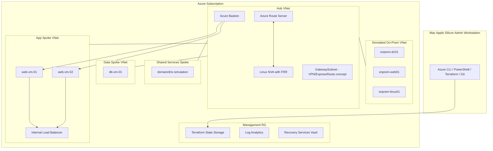

# Architecture Overview

## Lab topology

## Design principle

The lab uses Azure to simulate both sides of the hybrid environment. This keeps the lab practical on Apple Silicon while still teaching the real enterprise concepts: routing, DNS, BGP, secure access, IaC, change control, monitoring, and cost governance.
